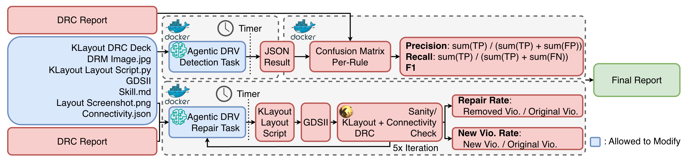

# DAC 2026 DRC Benchmark



A benchmark framework for evaluating LLM models on chip physical design tasks -- specifically **DRC repair** and **DRC detection** -- using the ASAP7 7nm PDK and KLayout DRC.

This benchmark runs inside a self-contained Docker container. KLayout 0.30.1 and the Cursor/Claude Code CLIs are pre-installed in the image. No host KLayout installation or commercial EDA licenses are required.

Shortcut: [Table of Contents](#table-of-contents) | [Benchmark Tasks](#benchmark-tasks) | [Quick Start](#quick-start) | [Pipeline Architecture](#pipeline-architecture) | [Detection Isolation](#detection-isolation) | [Scoring Methodology](#scoring-methodology) | [Results](#results) | [Processed DRC Reports](#processed-drc-reports) | [Detection Output Format](#detection-output-format) | [Score Output](#score-output) | [Design Types](#design-types) 

---

## Table of Contents

- *[Dockerfile.repair](./Dockerfile.repair)*: Repair-task image (AlmaLinux 8.10 + KLayout 0.30.1 + Cursor Agent CLI + Claude Code CLI).
- *[Dockerfile.detection](./Dockerfile.detection)*: Detection-task image -- no KLayout, runtime iptables blocklist on klayout/package-index domains to prevent the agent from invoking or installing DRC tools.
- *[CLAUDE.md](./CLAUDE.md)*: Agent behavior contract read by the LLM inside the container (unattended-Docker rules: never ask, never wait, never abort).
- *[docker/](./docker)*: Build-time helpers for the detection image (`entrypoint-blocklist.sh`).
- *[case_stat.md](./case_stat.md)*: Test case statistics -- polygon target rules, block design details, and cell DRC violations.
- *[example/](./example)*: Customizable files -- modify here and copy to *[src/](./src)* to use.
- *[src/](./src)*: Pipeline source code and agent scripts (incl. `skill.md`, the ASAP7 DRC reference fed to agents via `path_to_skill`).
- *[testcase/](./testcase)*: Test case assets and ASAP7 technology files.
- *[result/](./result)*: LLM outputs, stored at `result/<model_name>/<design_type>/<task_type>/<case_name>/` (auto-created on first run).
- *[score/](./score)*: Evaluation scores, stored at `score/<model_name>/<design_type>/<task_type>/` (auto-created on first run).
- *[task/](./task)*: Formatted prompts (auto-created on first run).
- *[temp/](./temp)*: Intermediate/scratch files written by LLM agents; cleaned up after each run (auto-created on first run).
- *[logs/](./logs)*: Full pipeline console logs (`<model>_<design>_<task>_<case>.log`) and `runtime.csv` (auto-created on first run).

---

## Benchmark Tasks

### Task 1: DRC Repair

The LLM agent receives a layout (GDS, layout script, screenshot) along with its KLayout DRC report and the ASAP7 design rule documentation. It must produce a **modified layout script** that resolves all reported violations without introducing new ones or corrupting the design.

**Inputs provided to the agent:**


| Input                       | Description                                                                |
| --------------------------- | -------------------------------------------------------------------------- |
| Layout script (`.py`)       | KLayout Python (`pya` API) script that generates the GDS                   |
| GDS file (`.gds`)           | Compiled GDS-II binary layout                                              |
| Layout screenshot (`.png`)  | Visual rendering of the layout                                             |
| DRC report (`.drc.json`)    | Processed DRC report in structured JSON with violation counts and geometry |
| Design rule file (`.lydrc`) | KLayout DRC rule file defining every design rule                           |
| Skill document (`skill.md`) | ASAP7 DRC knowledge reference for LLM agents                               |
| Connectivity JSON (`.json`) | Golden connectivity reference (cell/block only); the agent uses this with `check_connectivity.py` to verify electrical connections are preserved |


**Expected output:** The agent saves a modified KLayout Python layout script directly to `result/<model_name>/<design_type>/repair/<case_name>/<case_name>_repaired.py`.

**Evaluation flow:**

1. LLM's modified script is executed via KLayout to produce a new GDS
2. KLayout DRC is re-run on the new GDS
3. Repaired DRC results are converted to `.drc.json` for consistent comparison
4. Sanity check validates GDS integrity (top cell, layers, cell structure; for polygon designs, also verifies shape count per layer is unchanged)
5. Connectivity check verifies electrical connections are preserved (cell/block only)
6. Golden `.drc.json` and repaired `.drc.json` are compared to compute scoring metrics

### Task 2: DRC Detection

The LLM agent receives the same layout inputs **except** the DRC report. It must predict which rules are violated, estimate the violation count for each, and provide **DRV (Design Rule Violation) regions** for every violation instance.

**DRV region format:**

- **Spacing violations** (`.S.` rules): **edge pair** -- the two edges that are too close, each as `[x1, y1, x2, y2]` in dbu (integer database units; 1 dbu = 0.00025 um)
- **All other violations**: **bounding box** -- `[xmin, ymin, xmax, ymax]` in dbu (integer database units; 1 dbu = 0.00025 um)

**Expected output:** The agent saves a JSON array of predicted violations directly to `result/<model_name>/<design_type>/detection/<case_name>/<case_name>_detection.json`:

```json
[
  {
    "rule_name": "M1.S.4",
    "violation_count": 1,
    "violations": [
      {"type": "edge_pair", "edge1": [0, 200, 80, 200], "edge2": [0, 312, 80, 312]}
    ]
  },
  {
    "rule_name": "ACTIVE.A.1A",
    "violation_count": 1,
    "violations": [
      {"type": "bbox", "bbox": [0, 0, 270, 270]}
    ]
  }
]
```

**Evaluation flow:**

1. LLM's detection JSON is parsed (including DRV regions)
2. Golden `.drc.json` report is parsed (contains both violation counts and per-violation geometry)
3. Predicted violations are matched to golden violations using **geometry-based matching**:
  - **Polygon** golden bbox (non-zero area): overlap + area ratio within `[0.81, 1.21]` (linear ±10% squared)
  - **Edge** golden bbox (degenerate line, one dim = 0): both edge endpoints lie inside the predicted bbox AND the predicted bbox's longest side must not exceed `edge_length × 1.1`
  - Both criteria must be met for a match
4. TP (matched), FP (unmatched predicted), FN (unmatched golden) are computed per rule
5. Aggregate and per-rule precision/recall/F1 metrics are calculated

---

## Quick Start

### Prerequisites

- **Docker** -- for building and running the benchmark container
- **Cursor CLI on the host** (for Cursor pipeline) -- install and log in:
  ```bash
  curl https://cursor.com/install -fsS | bash
  agent login
  ```
  The login credentials at `~/.config/cursor/auth.json` are bind-mounted (read-only) into the container at runtime.
- **Claude Code CLI on the host** (for Claude Code pipeline) -- install and log in:
  ```bash
  curl -fsSL https://claude.ai/install.sh | bash
  claude login
  ```
  The login credentials at `~/.claude/` are bind-mounted (read-only) into the container at runtime.
- **KLayout 0.30.1** -- pre-installed in the Docker image (downloaded from klayout.org during build)
- **Python 3.6+** -- pre-installed in the Docker image (standard library only; no extra pip packages required)

### 1. Build the Docker Images

Two images are used:

- `drc-benchmark-repair` (full KLayout) -- for repair tasks, which legitimately need to run DRC.
- `drc-benchmark-detection` (no KLayout, with iptables blocklist on klayout/package-index domains) -- for detection tasks, to prevent the agent from leaking the golden DRC answer by invoking or installing KLayout.

```bash
cd DAC26_DRC_Benchmark/
docker build -f Dockerfile.repair    -t drc-benchmark-repair    .
docker build -f Dockerfile.detection -t drc-benchmark-detection .
```

Both images are AlmaLinux 8.10 with Cursor CLI + Claude Code CLI pre-installed. The repair image additionally has KLayout 0.30.1, Ruby, and Qt5. The detection image has Python 3.6 and `iptables` only; download tools (`wget`, `curl`, `pip`, `yum`, `rpm`, `gcc`, `git`, etc.) are stripped, and the entrypoint installs a runtime blocklist of klayout.org, pypi.org, github.com, etc. See [Detection Isolation](#detection-isolation) below.

### 2. Run a Single Test Case

**All commands must be run from the `DAC26_DRC_Benchmark/` directory.** To run a single case, prepare an `info.json` (see `example/info.json` for the required keys) and call the pipeline script inside the Docker container. Note: `output_path` and `temp_dir` are automatically overwritten by the pipeline with computed container paths -- you can leave them empty or set them to any placeholder value.

Use `drc-benchmark-repair` for repair tasks and `drc-benchmark-detection` for detection tasks. Detection additionally requires `--cap-add=NET_ADMIN` so the container entrypoint can program its iptables blocklist.

Both examples mirror what `evaluate_cursor.sh` / `evaluate_claude.sh` do per case: bind-mount only the single credential file (not the whole credential directory), bind-mount the four runtime I/O directories (`result`, `score`, `logs`, `temp`), and inject the golden DRC report via `docker cp` rather than a volume mount so detection runs never see it on the filesystem before the scoring phase.

**Cursor Agent CLI (repair example):**

```bash
CASE=Cell1
DESIGN=cell
CONTAINER=drc-bench-$CASE

docker create --name "$CONTAINER" \
    -v "$HOME/.config/cursor/auth.json:/root/.config/cursor/auth.json:ro" \
    -v "$(pwd)/result:/workspace/result" \
    -v "$(pwd)/score:/workspace/score" \
    -v "$(pwd)/logs:/workspace/logs" \
    -v "$(pwd)/temp:/workspace/temp" \
    drc-benchmark-repair \
    sleep infinity
docker start "$CONTAINER"

docker cp info.json "$CONTAINER:/workspace/task/info.json"
docker exec "$CONTAINER" mkdir -p "/workspace/testcase/asap7/$DESIGN/drc_report"
docker cp "testcase/asap7/$DESIGN/drc_report/$CASE.drc.json" \
    "$CONTAINER:/workspace/testcase/asap7/$DESIGN/drc_report/"

docker exec "$CONTAINER" bash src/run_pipeline_cursor.sh /workspace/task/info.json

docker rm -f "$CONTAINER"
```

**Claude Code CLI (detection example):**

Detection runs `--agent-only` first (no golden report visible), then `docker cp` injects the golden report, then `--score-only`. Detection additionally requires `--cap-add=NET_ADMIN` so the entrypoint can program its iptables blocklist.

```bash
CASE=Cell1
DESIGN=cell
CONTAINER=drc-bench-$CASE

docker create --name "$CONTAINER" --cap-add=NET_ADMIN \
    -v "$HOME/.claude/.credentials.json:/root/.claude/.credentials.json:ro" \
    -v "$(pwd)/result:/workspace/result" \
    -v "$(pwd)/score:/workspace/score" \
    -v "$(pwd)/logs:/workspace/logs" \
    -v "$(pwd)/temp:/workspace/temp" \
    drc-benchmark-detection \
    sleep infinity
docker start "$CONTAINER"

docker cp info.json "$CONTAINER:/workspace/task/info.json"

# Phase 1: agent-only (golden report NOT yet in container)
docker exec "$CONTAINER" bash src/run_pipeline_claude.sh --agent-only /workspace/task/info.json

# Phase 2: inject golden report, then score
docker exec "$CONTAINER" mkdir -p "/workspace/testcase/asap7/$DESIGN/drc_report"
docker cp "testcase/asap7/$DESIGN/drc_report/$CASE.drc.json" \
    "$CONTAINER:/workspace/testcase/asap7/$DESIGN/drc_report/"
docker exec "$CONTAINER" bash src/run_pipeline_claude.sh --score-only /workspace/task/info.json

docker rm -f "$CONTAINER"
```

The `--agent-only` / `--score-only` phase flags exist exactly to gate when the golden DRC report becomes visible to the agent (see [Pipeline Architecture](#pipeline-architecture)).

### 3. Reproduce Paper Experiments

`evaluate_cursor.sh` (Cursor) and `evaluate_claude.sh` (Claude Code) are provided to reproduce the experiments in the paper. They automate info.json generation, Docker container lifecycle, and golden DRC report injection across all task/model/case combinations. Most users do not need these scripts.

```bash
# Edit the CASES array, then run:
bash src/evaluate_cursor.sh          # Cursor Agent CLI
bash src/evaluate_claude.sh   # Claude Code CLI
```

---

## Pipeline Architecture

The core pipeline runs inside a Docker container via `run_pipeline_cursor.sh` (Cursor) or `run_pipeline_claude.sh` (Claude Code). For paper experiments, `evaluate_cursor.sh` / `evaluate_claude.sh` wraps this with automated info.json generation and Docker container management:

```
evaluate_cursor.sh (paper experiments only)                             [HOST]
  |
  +-- For each task_type × model_name × case:
  |     +-- Generate info.json (build_case_info.py)
  |     +-- Create Docker container
  |     +-- Copy info.json into container
  |     +-- [Repair]: copy golden DRC report, run full pipeline
  |     +-- [Detection]: run agent-only, copy golden DRC report, run score-only
  |     +-- Clean up container
```

Inside the container, `run_pipeline_cursor.sh` executes:

```
run_pipeline_cursor.sh <info.json>                                      [CONTAINER]
  |
  +-- Step 1: Post-process info.json (rewrite paths to container perspective)
  +-- Step 2: Format prompt (prompt_format.py + prompt_repair/detection.md)
  +-- Step 3: Call LLM model once (agent_cursor.py or agent_claude.py)
  |            The agent runs to completion; no timeout, no reminder.
  |            The wrapper parses CLI JSON output for token usage and
  |            emits STATUS, TOKENS_JSON, and RUNTIME_SECONDS on stderr.
  |
  +-- [Repair only]:
  |    +-- Step 3.5: Render GDS (KLayout batch mode)
  |    +-- Step 4:   Run KLayout DRC -> .lyrpt -> .drc.json
  |    +-- Step 5:   Sanity check
  |    +-- Step 5.5: Connectivity check (cell/block only)
  |
  +-- Step 6: Score (score_repair.py or score_detection.py) -- also writes
              agent_status, runtime_seconds, and the 4 token fields into
              the score JSON.
  +-- Write CSV (write_score_csv.py)
  +-- Append runtime row to logs/runtime.csv (log_runtime.py)
```

Each agent call is a **single invocation** that runs to natural completion; token usage is captured from the CLI JSON output.

### Supported Models

Models are invoked via the Cursor Agent CLI (`src/agent_cursor.py`) or Claude Code CLI (`src/agent_claude.py`). The 6 default benchmark models (Cursor model names) are:


| Default Model              | Provider  | Description                |
| -------------------------- | --------- | -------------------------- |
| `gpt-5.4-high`             | OpenAI    | GPT-5.4 (high reasoning)   |
| `claude-4.6-opus-high`     | Anthropic | Claude 4.6 Opus (high)     |
| `claude-4.6-sonnet-medium` | Anthropic | Claude 4.6 Sonnet (medium) |
| `gemini-3.1-pro`           | Google    | Gemini 3.1 Pro             |
| `grok-4-20`                | xAI       | Grok 4.20                  |
| `kimi-k2.5`                | Moonshot  | Kimi K2.5                  |


See [Cursor Models and Pricing](https://cursor.com/docs/models-and-pricing) for the full list of available models. Any model supported by the Cursor Agent CLI can be passed as `model_name`.

### Intermediate Files

LLM agents are instructed to place all intermediate/scratch files (test scripts, debug outputs, draft fixes) in the `temp/` directory at the project root. The `--temp_dir` flag passed to `agent_cursor.py` ensures this directory is created before the agent runs. The prompt templates embed the concrete `temp_dir` path via the `{temp_dir}` placeholder so the agent knows where to write. The `temp/` directory is automatically deleted at the end of each pipeline run.

### Detection Isolation

Detection agents should predict DRC violations from the layout script alone, without running a real DRC tool. To enforce this, `Dockerfile.detection`:

- Ships without `klayout`, `wget`, `curl`, `pip`, `yum`, `rpm`, `gcc`, `git`, `make`, `cpio`.
- Has `iptables` pre-installed. The entrypoint resolves known DRC-install domains (`klayout.org`, `pypi.org`, `files.pythonhosted.org`, `github.com`, `gitlab.com`, `conda.anaconda.org`, `sourceforge.net`, `dl.fedoraproject.org`, ...) to IPs and installs `OUTPUT REJECT` rules for each.
- Leaves the rest of the internet reachable so the agent can still call the Anthropic / Cursor API endpoints through Docker's default NAT.

Running the image requires `--cap-add=NET_ADMIN` (both `evaluate_*.sh` scripts add this automatically for detection tasks). Repair tasks are unaffected and continue to run in `drc-benchmark-repair` with full KLayout available.

### Runtime Tracking

Every pipeline run appends a row to `logs/runtime.csv` with columns:

```
model, effort, task_type, design_type, case_name,
agent_status, agent_runtime_seconds,
input_tokens, output_tokens, cache_read_tokens, cache_write_tokens,
timestamp
```

The score JSON embeds `runtime_seconds`, which is the **agent runtime** (subprocess wall-clock time reported by the agent wrapper).

### Token Accounting

Each pipeline run records four token counters captured from the CLI's JSON
stdout:

| Field | Definition |
|-------|------------|
| `input_tokens` | New input tokens (excluding any served from prompt cache) |
| `cache_write_tokens` | Tokens written to the prompt cache this call |
| `cache_read_tokens` | Tokens served from the prompt cache this call |
| `output_tokens` | Output tokens (includes reasoning tokens; the CLI does not split them out) |

CLI-level field names differ by vendor: Cursor's Agent CLI uses camelCase
(`inputTokens`, `outputTokens`, `cacheReadTokens`, `cacheWriteTokens`); the
Claude Code CLI uses snake_case (`input_tokens`, `output_tokens`,
`cache_read_input_tokens`, `cache_creation_input_tokens`). `agent_cursor.py` and
`agent_claude.py` both normalize these into the snake_case names above.

On agent failure (non-zero CLI exit, unparseable JSON, missing `usage` object,
etc.), `agent_status` is set to `"fail"` and all four token counters are
reported as `0`; the recorded `runtime_seconds` is still the actual elapsed
time between the agent launching and the failure.

### Pipeline Logs

All console output (stdout + stderr) from each pipeline run is captured to a log file at:

```
logs/<model_name>_<design_type>_<task_type>_<case_name>.log
```

The same output is still printed to the terminal in real time.

---

## Scoring Methodology

### Repair Metrics


| Metric                   | Formula                                    | Description                                                                                                                                                                                                                                                                                                            |
| ------------------------ | ------------------------------------------ | ---------------------------------------------------------------------------------------------------------------------------------------------------------------------------------------------------------------------------------------------------------------------------------------------------------------------- |
| `repair_rate`            | `removed_violations / original_violations` | Fraction of original violations eliminated                                                                                                                                                                                                                                                                             |
| `new_violation_rate`     | `new_violations / original_violations`     | New violations introduced relative to original count                                                                                                                                                                                                                                                                   |
| `connectivity_preserved` | boolean                                    | Whether all original electrical connections remain (cell/block only). Uses shape-aware DFS with per-path visited vias, directional search rule, redundant via pruning, and full polygon shape identity. Golden connectivity is stored as JSON in `testcase/asap7/{cell,block}/connectivity/`. |


### Detection Metrics (Geometry-Based)

Predicted violations are matched to golden violations using **geometry-based matching**:

1. Each violation's DRV region is converted to a bounding box (edge pairs use the bbox enclosing both edges).
2. Match criteria depend on the golden bbox shape:
  - **Polygon / non-degenerate** (`w*h > 0`): bboxes overlap AND area ratio `0.81 <= predicted_area / golden_area <= 1.21` (linear ±10% squared into area tolerance).
  - **Edge / line** (`w*h = 0` and `w+h > 0`): both edge endpoints lie inside the predicted bbox AND the predicted bbox's longest side is at most `edge_length × 1.1`.
  - **Dot** (`w = h = 0`): cannot match. The ingest pipeline (`process_klayout_reports.py --fix-dots`) replaces dot violations with their containing polygon's bbox so this case does not occur in practice.
3. **Hopcroft-Karp maximum bipartite matching** is used per rule for optimal (order-independent) matching.
4. When geometry is unavailable on either side, no TP credit is awarded (`tp=0`). Affected rules are listed in the `geometry_unavailable_rules` output field.
5. Scoring policy: `geometry_required_edge_aware`. All TP credit requires both predicted and golden geometry.


| Metric          | Formula                               | Description              |
| --------------- | ------------------------------------- | ------------------------ |
| `Precision` | `sum(TP) / (sum(TP) + sum(FP))`       | Aggregate precision      |
| `Recall`    | `sum(TP) / (sum(TP) + sum(FN))`       | Aggregate recall         |
| `F1`        | Harmonic mean of precision and recall | Aggregate F1             |

---

## Results

| Task | Metric | (Claude Code) Claude 4.6 Opus - High Effort | | | | | | (Claude Code) Claude 4.6 Sonnet - Medium Effort | | | | | | (Cursor) Claude 4.6 Opus - High Effort | | | | | | (Cursor) Claude 4.6 Sonnet - Medium Effort | | | | | | (Cursor) GPT 5.4 - High Effort | | | | | | (Cursor) Gemini 3.1 Pro | | | | | | (Cursor) Grok 4-20 | | | | | | (Cursor) Kimi K2.5 | | | | | |
|---|---|---|---|---|---|---|---|---|---|---|---|---|---|---|---|---|---|---|---|---|---|---|---|---|---|---|---|---|---|---|---|---|---|---|---|---|---|---|---|---|---|---|---|---|---|---|---|---|---|
| | | B7 | B5 | C228 | C1 | P263 | P69 | B7 | B5 | C228 | C1 | P263 | P69 | B7 | B5 | C228 | C1 | P263 | P69 | B7 | B5 | C228 | C1 | P263 | P69 | B7 | B5 | C228 | C1 | P263 | P69 | B7 | B5 | C228 | C1 | P263 | P69 | B7 | B5 | C228 | C1 | P263 | P69 | B7 | B5 | C228 | C1 | P263 | P69 |
| Detect | Precision | 0.12 | 0.01 | 0.00 | 0.25 | 1.00 | 1.00 | 0.03 | 1.00 | 1.00 | 0.30 | 1.00 | 1.00 | 0.07 | 0.00 | 0.39 | 0.87 | 1.00 | 1.00 | 0.00 | 0.95 | 1.00 | 1.00 | 1.00 | 0.00 | 0.78 | 0.95 | 1.00 | 0.26 | 1.00 | 1.00 | 0.00 | 0.00 | 0.00 | 1.00 | 1.00 | 1.00 | 0.00 | 0.78 | 0.00 | 0.00 | 0.00 | 0.00 | 0.00 | 0.00 | 0.83 | 0.18 | 0.50 | 0.00 |
| | Recall | 0.10 | 0.03 | 0.00 | 0.15 | 1.00 | 1.00 | 0.04 | 0.01 | 0.95 | 1.00 | 1.00 | 1.00 | 0.01 | 0.00 | 0.95 | 1.00 | 1.00 | 1.00 | 0.00 | 0.52 | 0.95 | 0.15 | 1.00 | 0.00 | 0.68 | 0.59 | 1.00 | 1.00 | 1.00 | 1.00 | 0.00 | 0.00 | 0.00 | 1.00 | 1.00 | 1.00 | 0.00 | 0.52 | 0.00 | 0.00 | 0.00 | 0.00 | 0.00 | 0.00 | 0.53 | 0.85 | 0.50 | 0.00 |
| | F1 | 0.11 | 0.02 | 0.00 | 0.19 | 1.00 | 1.00 | 0.04 | 0.03 | 0.97 | 0.46 | 1.00 | 1.00 | 0.03 | 0.00 | 0.55 | 0.93 | 1.00 | 1.00 | 0.00 | 0.67 | 0.97 | 0.27 | 1.00 | 0.00 | 0.73 | 0.73 | 1.00 | 0.41 | 1.00 | 1.00 | 0.00 | 0.00 | 0.00 | 1.00 | 1.00 | 1.00 | 0.00 | 0.62 | 0.00 | 0.00 | 0.00 | 0.00 | 0.00 | 0.00 | 0.65 | 0.30 | 0.50 | 0.00 |
| | Runtime (s) | 3,023 | 1,246 | 3,915 | 3,102 | 217 | 908 | 1,065 | 703 | 557 | 733 | 140 | 430 | 4,618 | 1,614 | 845 | 1,015 | 153 | 460 | 5,841 | 626 | 641 | 504 | 140 | 311 | 2,347 | 1,084 | 248 | 582 | 117 | 202 | 228 | 51 | 22 | 450 | 49 | 127 | 32 | 78 | 32 | 96 | 37 | 38 | 216 | 203 | 177 | 133 | 35 | 115 |
| | Input Token | 169(79) | 321K(318K) | 166K(164K) | 2.8K(18) | 2.8K(14) | 2.8K(14) | 73(73) | 42(42) | 33(33) | 7.6K(7.6K) | 19(19) | 15K(15K) | 222 | 106 | 31 | 30 | 19 | 19 | 82 | 17 | 27 | 31 | 22 | 19 | 214K | 145K | 90K | 85K | 98K | 75K | 123K | 51K | 34K | 238K | 48K | 109K | 112K | 74K | 77K | 85K | 139K | 126K | 0 | 0 | 0 | 0 | 0 | 0 |
| | Cache Read | 7.4M(5.5M) | 6.2M(6.2M) | 810K(810K) | 1.3M(1.3M) | 400K(400K) | 1.1M(1.1M) | 6.2M(6.2M) | 2.1M(2.1M) | 2.1M(2.1M) | 2.2M(2.2M) | 382K(382K) | 698K(698K) | 19M | 8.7M | 2.8M | 2.8M | 1.2M | 1.1M | 5.8M | 1.2M | 2.2M | 2.5M | 1.3M | 1.0M | 4.6M | 1.3M | 974K | 521K | 513K | 488K | 0 | 0 | 0 | 0 | 0 | 0 | 1.2M | 2.7M | 837K | 2.4M | 1.2M | 1.0M | 1.4M | 2.9M | 1.6M | 797K | 328K | 755K |
| | Cache Write | 627K(436K) | 397K(397K) | 140K(140K) | 140K(140K) | 38K(38K) | 120K(120K) | 395K(395K) | 386K(386K) | 131K(131K) | 135K(135K) | 40K(40K) | 80K(80K) | 740K | 386K | 124K | 132K | 79K | 172K | 624K | 220K | 127K | 123K | 67K | 94K | -- | -- | -- | -- | -- | -- | -- | -- | -- | -- | -- | -- | -- | -- | -- | -- | -- | -- | 514K | 1.1M | 862K | 582K | 124K | 477K |
| | Output Token | 152K(129K) | 65K(65K) | 232K(232K) | 129K(129K) | 12K(12K) | 54K(54K) | 85K(85K) | 54K(54K) | 48K(48K) | 58K(58K) | 8K(8K) | 28K(28K) | 177K | 66K | 52K | 60K | 6K | 23K | 57K | 4K | 57K | 42K | 9K | 20K | 35K | 18K | 11K | 28K | 5.6K | 10K | 503 | 301 | 271 | 4.5K | 814 | 482 | 938 | 6.9K | 1.1K | 9.0K | 1.2K | 2.3K | 17K | 21K | 25K | 22K | 4.1K | 14K |
| Repair | Repair Rate | 0.30 | -- | 1.00 | 1.00 | 1.00 | 1.00 | 0.63 | 0.46 | 0.26 | 1.00 | 1.00 | 1.00 | -- | 0.44 | 1.00 | 1.00 | 1.00 | 1.00 | 0.31 | -- | 1.00 | 1.00 | 1.00 | 1.00 | 0.20 | 0.35 | 1.00 | 1.00 | 1.00 | 1.00 | -- | -- | 0.16 | 1.00 | 1.00 | 1.00 | -- | -- | 0.16 | 0.15 | 0.50 | 0.00 | -- | -- | 0.05 | 0.92 | 1.00 | 0.00 |
| | New Violation Rate | 0.36 | -- | 0.00 | 0.00 | 0.00 | 0.00 | 0.14 | 2.12 | 0.00 | 0.00 | 0.00 | 0.00 | -- | 0.43 | 0.00 | 0.00 | 0.00 | 0.00 | 9.34 | -- | 0.00 | 0.00 | 0.00 | 0.00 | 0.11 | 0.24 | 0.00 | 0.00 | 0.00 | 0.00 | -- | -- | 0.05 | 0.00 | 0.00 | 3.00 | -- | -- | 0.42 | 1.62 | 0.00 | 1.00 | -- | -- | 0.00 | 4.23 | 0.50 | 1.00 |
| | Runtime (s) | 5,281 | 7,879 | 1,684 | 1,055 | 225 | 1,146 | 1,740 | 1,493 | 3,852 | 3,121 | 182 | 1,003 | 7,211 | 2,496 | 995 | 983 | 167 | 572 | 1,840 | 4,303 | 1,025 | 794 | 128 | 301 | 2,342 | 820 | 438 | 428 | 192 | 385 | 658 | 3,931 | 161 | 540 | 86 | 125 | 99 | 76 | 101 | 86 | 39 | 46 | 2,532 | 3,170 | 76 | 264 | 39 | 28 |
| | Input Token | 2.4K(2K) | 8.2K(8.2K) | 16(16) | 6.8K(6.8K) | 13(13) | 9(9) | 167K(167K) | 109K(109K) | 294K(294K) | 18(18) | 14(14) | 10(10) | 250 | 101 | 44 | 47 | 17 | 26 | 19 | 130 | 36 | 36 | 17 | 18 | 167K | 279K | 145K | 134K | 57K | 82K | 191K | 21K | 125K | 143K | 70K | 65K | 229K | 142K | 132K | 119K | 55K | 83K | 0 | 0 | 0 | 0 | 0 | 0 |
| | Cache Read | 9.3M(7M) | 11.5M(11.5M) | 1.5M(1.5M) | 1.1M(1.1M) | 251K(251K) | 382K(382K) | 1.1M(1.1M) | 1.5M(289K) | 1.5M(1.5M) | 940K(940K) | 336K(336K) | 520K(520K) | 19M | 9.4M | 5.4M | 5.3M | 474K | 1.2M | 515K | 10.6M | 3.7M | 4.3M | 932K | 1.1M | 5.6M | 4.6M | 1.2M | 1.4M | 472K | 410K | 0 | 0 | 0 | 0 | 0 | 0 | 1.4M | 882K | 781K | 1.3M | 1.1M | 506K | 6.3M | 2.8M | 1.1M | 1.1M | 398K | 209K |
| | Cache Write | 1M(724K) | 1.5M(1.5M) | 152K(152K) | 127K(127K) | 32K(32K) | 87K(87K) | 169K(169K) | 151K(82K) | 208K(208K) | 134K(134K) | 29K(29K) | 88K(88K) | 1.7M | 619K | 174K | 289K | 25K | 68K | 50K | 217K | 293K | 235K | 67K | 93K | -- | -- | -- | -- | -- | -- | -- | -- | -- | -- | -- | -- | -- | -- | -- | -- | -- | -- | 1.8M | 1.1M | 679K | 561K | 192K | 119K |
| | Output Token | 311K(261K) | 464K(464K) | 100K(100K) | 66K(66K) | 11K(11K) | 58K(58K) | 108K(108K) | 111K(104K) | 244K(244K) | 210K(210K) | 14K(14K) | 64K(64K) | 290K | 110K | 49K | 48K | 7K | 27K | 4K | 122K | 81K | 60K | 8K | 20K | 46K | 42K | 26K | 27K | 9.3K | 12K | 1.9K | 197 | 9.9K | 9.5K | 2K | 2.4K | 13K | 10K | 15K | 11K | 2.0K | 4.1K | 28K | 109K | 13K | 49K | 5.5K | 2.6K |

**Notes:** Cases: B = Block, C = Cell, P = Polygon. **--**: Failed to produce a valid GDSII or preserve connectivity. CC = Claude Code, Cu = Cursor. Claude Code hardcodes the subagent to Claude 4.5 Haiku; in each token-count entry, the first number is the total and the number in parentheses is the Opus/Sonnet count. Cache write tokens are not available for Gemini, Grok, and GPT models.


---

## Processed DRC Reports

Golden DRC reports are pre-processed from KLayout's native `.lyrpt` XML format into structured JSON files stored at `testcase/asap7/{cell,polygon,block}/drc_report/<case_name>.drc.json`.

**JSON format:**

```json
{
  "case_name": "Cell1",
  "design_type": "cell",
  "total_violations": 20,
  "total_rules_violated": 2,
  "rules": {
    "M1.S.4": {
      "violation_count": 1,
      "description": "Minimum spacing of M1 on same track is 18 nm.",
      "violations": [
        {
          "type": "edge_pair",
          "edges": [[1768, 832, 1840, 832], [1768, 944, 1840, 944]],
          "bbox": [1768, 832, 1840, 944]
        }
      ]
    }
  }
}
```

The pipeline uses `.drc.json` for both golden and repaired reports. After KLayout DRC runs on a repaired GDS, the `.lyrpt` results are converted to JSON for consistent comparison.

---

## Detection Output Format

The detection agent saves its predictions as a JSON array at `result/<model_name>/<design_type>/detection/<case_name>/<case_name>_detection.json`. Each top-level object represents one violated rule.

All coordinates are in **dbu (database units)** -- integer coordinates from the layout script (`1 dbu = 0.00025 um`). These are the same units used by the golden `.drc.json` report.

**Per-violation geometry:**

- `"type": "edge_pair"` -- for spacing rules (`.S.`); contains `edge1` and `edge2`, each `[x1, y1, x2, y2]`.
- `"type": "bbox"` -- for every other rule (width, enclosure, area, ...); contains `bbox` as `[xmin, ymin, xmax, ymax]`.

**Example:**

```json
[
  {
    "rule_name": "M1.S.4",
    "violation_count": 1,
    "violations": [
      {
        "type": "edge_pair",
        "edge1": [0, 200, 80, 200],
        "edge2": [0, 312, 80, 312]
      }
    ]
  },
  {
    "rule_name": "ACTIVE.A.1A",
    "violation_count": 1,
    "violations": [
      {
        "type": "bbox",
        "bbox": [0, 0, 270, 270]
      }
    ]
  }
]
```

If no violations are detected, the agent writes an empty array `[]`.

---

## Score Output

Each pipeline run produces `.json` and `.csv` files at:

```
score/<run_id>/<design_type>/<task_type>/<case_name>_score.json
score/<run_id>/<design_type>/<task_type>/<case_name>_score.csv
```

For claude pipeline runs, `run_id` is `<model_name>-<effort>` (e.g. `claude-sonnet-4-6-medium`) so different effort tiers produce distinct output folders; for cursor runs, `run_id` is just `<model_name>`.

**Both repair and detection** include:


| Key | Description |
|-----|-------------|
| `agent_status` | `"success"` or `"fail"` |
| `runtime_seconds` | Agent wall-clock runtime |
| `input_tokens` | New input tokens |
| `output_tokens` | Output tokens (includes reasoning) |
| `cache_read_tokens` | Cache read tokens |
| `cache_write_tokens` | Cache creation tokens |


**Repair tasks** additionally include:


| Key | Description |
|-----|-------------|
| `sanity_passed` | Overall result of structural sanity checks (`true` / `false`) |
| `sanity_details` | Human-readable summary of any failed sanity checks |
| `top_cell_exists` | Modified GDS has a top cell matching the original |
| `gds_not_empty` | Modified GDS contains at least one shape |
| `critical_layers_preserved` | All ASAP7 critical layers (nwell / fin / gate / active / v0 / m1) present |
| `cell_structure_intact` | No original cell definitions were deleted |
| `outline_boundary_respected` | (cell/block) All shapes within the original outline region |
| `protruding_layers` | (cell/block, only on failure) List of layers with shapes outside the original outline, including layer/datatype and the enclosing bbox |
| `instance_placements_unchanged` | (cell/block) Subcell instance placements match the original |
| `missing_instances` | (cell/block, only on failure) Subcell instances from the original that are missing or moved in the modified layout |
| `extra_instances` | (cell/block, only on failure) Subcell instances present in the modified layout but not in the original |
| `polygon_shape_counts_ok` | (polygon) Per-layer shape counts unchanged vs. original |
| `shape_count_mismatches` | (polygon, only on failure) Per-layer delta between original and modified shape counts |
| `connectivity_preserved` | (cell/block) All original electrical connections remain |


**Detection tasks** additionally include:


| Key                          | Description                                                        |
| ---------------------------- | ------------------------------------------------------------------ |
| `matching_algorithm`         | `"hopcroft_karp"` -- algorithm used for violation matching         |
| `scoring_policy`             | `"geometry_required_edge_aware"` -- TP credit requires geometry on both sides; uses edge-encompass matching for line-shaped golden bboxes |
| `mercy_low` / `mercy_high`   | `0.81` / `1.21` -- area ratio bounds for polygon matches |
| `edge_side_tolerance`        | `1.1` -- multiplier on `edge_length` that caps the predicted bbox's longest side for edge matches |
| `geometry_unavailable_rules` | List of rule names where geometry was missing (tp forced to 0)     |


---

## Design Types


| Type      | Count | DRC Rule File      | Description                                                                                                                                                                 |
| --------- | ----- | ------------------ | --------------------------------------------------------------------------------------------------------------------------------------------------------------------------- |
| `cell`    | 255   | `asap7_cell.lydrc` | Standard-cell layouts (10-50 polygons, 5-15 violations)                                                                                                                     |
| `polygon` | 332   | `asap7.lydrc`      | Isolated polygon constructs testing specific DRC rules. Repair is restricted to resizing (width/length) or moving polygons; deletion and adding new polygons are forbidden. |
| `block`   | 7     | `asap7.lydrc`      | Larger block-level layouts with routing and vias (100+ polygons)                                                                                                            |
