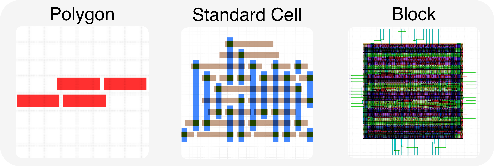

# testcase/ -- Test Case Assets and ASAP7 Technology Files



All test case data and ASAP7 PDK technology files used by the DRC benchmark pipeline.

---

## Table of Contents

- [*asap7/asap7.lydrc*](./asap7/asap7.lydrc): KLayout DRC rule file (polygon/block).
- [*asap7/asap7_cell.lydrc*](./asap7/asap7_cell.lydrc): KLayout DRC rule file (cell, adds m0 layer).
- [*asap7/asap7.lyt*](./asap7/asap7.lyt): KLayout technology file (layer stack, dbu).
- [*asap7/asap7.lyp*](./asap7/asap7.lyp): KLayout layer properties (display colors).
- [*asap7/drm_jpg/*](./asap7/drm_jpg): Design rule manual images.
- [*asap7/cell/*](./asap7/cell): 255 standard-cell test cases.
  - `gds/`: `Cell1.gds` ... `Cell255.gds`
  - `layout_script/`: `Cell1.py` ... `Cell255.py`
  - `layout_screenshot/`: `Cell1/Cell1.png` ...
  - `drc_report/`: `Cell1.drc.json` ... (255 JSON files)
  - `connectivity/`: `Cell1.json` ... (reference connectivity as JSON)
- [*asap7/polygon/*](./asap7/polygon): 332 polygon-level test cases.
  - `gds/`: `Polygon1.gds` ... `Polygon332.gds`
  - `layout_script/`: `Polygon1.py` ... `Polygon332.py`
  - `layout_screenshot/`: `Polygon1/Polygon1.png` ...
  - `drc_report/`: `Polygon1.drc.json` ... (332 JSON files)
- [*asap7/block/*](./asap7/block): 7 block-level test cases.
  - `gds/`: `Block1.gds` ... `Block7.gds`
  - `layout_script/`: `Block1.py` ... `Block7.py`
  - `layout_screenshot/`: `Block1/Block1.png` ...
  - `drc_report/`: `Block1.drc.json` ... (7 JSON files)
  - `connectivity/`: `Block1.json` ... (reference connectivity as JSON)

---

## Design Types

| Type | Cases | DRC Rules | Description |
|------|-------|-----------|-------------|
| `cell` | 255 | `asap7_cell.lydrc` | Standard-cell layouts -- small, tightly constrained geometries. 10-50 polygons, 5-15 violations. |
| `polygon` | 332 | `asap7.lydrc` | Isolated polygon constructs -- each tests a specific DRC rule in isolation. 2-10 polygons, 1-5 violations. |
| `block` | 7 | `asap7.lydrc` | Block-level layouts with multi-cell routing and vias. 100+ polygons, 10-50+ violations. |

---

## Test Case File Naming

All files for a single test case share the same base name:

| Directory | Pattern | Example |
|-----------|---------|---------|
| `gds/` | `<case_name>.gds` | `Cell1.gds` |
| `layout_script/` | `<case_name>.py` | `Cell1.py` |
| `layout_screenshot/` | `<case_name>/<case_name>.png` | `Cell1/Cell1.png` |
| `drc_report/` | `<case_name>.drc.json` | `Cell1.drc.json` |
| `connectivity/` | `<case_name>.json` | `Cell1.json` (cell/block only) |

The pipeline uses `<case_name>` (from info.json or as a positional argument to `run_pipeline.sh`) and constructs all file paths from it. For cell/block repair tasks, the golden connectivity JSON is passed to the agent via the `{path_to_connectivity_file}` prompt placeholder so the agent can verify connections using `check_connectivity.py`.

> **Note:** Golden DRC reports (`drc_report/`) are **not** included in the Docker image. For single-case runs, bind-mount the `drc_report/` directory into the container. For paper experiments, `evaluate.sh` injects them via `docker cp`. On the host filesystem, these files are present as listed above.

---

## ASAP7 Technology Files

- [*asap7.lydrc*](./asap7/asap7.lydrc): Main DRC ruleset (~375 rules). Width, spacing, enclosure, pitch, area, grid, angle constraints for all layers. Used for polygon and block designs.
- [*asap7_cell.lydrc*](./asap7/asap7_cell.lydrc): Cell-specific variant. Adds `m0 = input(0, 0)` layer definition.
- [*asap7.lyt*](./asap7/asap7.lyt): Technology file. Database unit (dbu): `0.00025` um. Layer stack, connectivity, reader/writer options.
- [*asap7.lyp*](./asap7/asap7.lyp): Layer properties. Display colors, fill patterns, transparency for layout rendering.

---

## DRC Report Formats

### KLayout DRC Report (`.lyrpt`)

KLayout's native XML report format. Generated at runtime when KLayout DRC is run on a repaired GDS (not stored as golden reports). Each violated rule is represented as an `<item>` block containing the rule name, violation count, and per-violation geometry markers (edge pairs or polygon outlines). The pipeline converts `.lyrpt` to `.drc.json` via `process_klayout_reports.py` for consistent comparison.

### Processed JSON Report (`.drc.json`)

Golden reports are stored as `.drc.json` in `drc_report/`. This is the primary format consumed by the pipeline and agent prompts. Contains per-rule violation counts, descriptions, and per-violation geometry in dbu (integer database units; 1 dbu = 0.00025 um). Example:

```json
{
  "case_name": "Cell1",
  "design_type": "cell",
  "total_violations": 3,
  "total_rules_violated": 1,
  "rules": {
    "M1.S.4": {
      "violation_count": 3,
      "description": "Minimum spacing of M1 on same track.",
      "violations": [
        {"type": "edge_pair", "edges": [[1768, 832, 1840, 832], [1768, 944, 1840, 944]], "bbox": [1768, 832, 1840, 944]}
      ]
    }
  }
}
```

---

## DRC Rule Naming Convention

ASAP7 DRC rule names follow: `LAYER.TYPE.NUMBER[SUFFIX]`

| Component | Examples | Meaning |
|-----------|----------|---------|
| `LAYER` | `WELL`, `FIN`, `GATE`, `ACTIVE`, `M0`-`M9`, `V0`-`V9` | Physical layer |
| `TYPE` | `W` (width), `S` (spacing), `EN` (enclosure), `EX` (extension), `A` (area) | Geometric property |
| `NUMBER` | `1`, `2`, `3`, ... | Rule index |
| `SUFFIX` | `A`, `B` (optional) | Sub-variant |

Examples: `WELL.W.1` (min WELL width 108nm), `FIN.W.1` (exact FIN width 7nm), `GATE.S.1` (exact GATE pitch 54nm), `M1.S.4` (min M1 spacing on same track).

**For detection output:**
- Rules with `.S.` (spacing) in the name -> LLM outputs edge pairs
- All other rules -> LLM outputs bounding boxes

---

## Layout Scripts (`.py`)

KLayout Python (`pya` API) scripts that generate GDS layouts:

```python
import pya

layout = pya.Layout()
layout.dbu = 0.00025

top = layout.create_cell("CellName")
l_m1 = layout.layer(pya.LayerInfo(19, 0))   # M1
l_v0 = layout.layer(pya.LayerInfo(18, 0))   # V0

top.shapes(l_m1).insert(pya.Box(0, 0, 200, 100))
top.shapes(l_v0).insert(pya.Box(50, 20, 90, 60))

layout.write("CellName.gds")
```

For the repair task, the LLM modifies this script to repair DRC violations. The modified script is executed via KLayout to produce a new GDS.
